# Defending Substitution-Based Profile Pollution Attacks on SequentialRecommenders

**摘要：**提出了一种基于替换的对抗攻击算法，该算法通过选择某些脆弱元素并将其替换为对抗项来修改输入序列。

使用所提出的**配置文件污染算法**性能显著下降。

设计了有效的对抗防御方法：狄利克雷邻域抽样——从一个由**多跳邻居**构造的凸包中抽取项目嵌入样本，以替换输入序列中的原始项目。

设计了一种针对顺序推荐系统的**对抗性训练方法**。

# 1 Introduction

基于替换的对抗性攻击 **操纵之前或正在进行的交互中的脆弱项**来破坏推荐(即无目标攻击)或操纵推荐项(即有目标攻击)

- 设计了一种**梯度引导**的基于替换的配置文件污染攻击算法。我们的攻击算法通过选择有限数量的易受攻击元素并将其替换为精心选择的对抗项来修改输入序列。

- 提出两种为序列推荐量身定制的**防御方法**。为了有效地训练鲁棒推荐器，提出了狄利克雷领域抽样方法（用嵌入矩阵构造多跳邻域，并通过狄利克雷分布抽样增强项嵌入来执行随机替换。）

- 设计了一种针对顺序推荐器的**对抗性训练方法**：用单热编码表示项目，并更新编码以搜索最坏情况的增强。（摘要中：用独热编码表示选定的项目，并对编码进行梯度上升，以搜索训练中项目嵌入的最坏情况线性组合。）

# 2 Related Work

## 2.1 推荐系统中的对抗性攻击

两类对抗性攻击：

（1）**数据中毒**攻击：制造虚假的用户配置文件，并将这些配置文件注入到训练数据中，在部署时导致有偏差的推荐结果。

（2）**配置文件污染**攻击：改变现有的用户配置文件（即用户交互），以操纵推荐项目。

*本文注重第二类攻击方法——配置文件污染攻击。本文提出的配置文件污染算法与之前的方法有两个不同之处：（1）将攻击范围扩展到**全序列**中的替换；（2）对对抗实例**施加约束**，以增加干净序列和对抗序列之间的相似性。

## 2.2 语言中的对抗性攻击

配置文件污染攻击方法通过**替换项**来实现，和各种NLP分类任务中的场景类似，本文把攻击中的**单词级替换**单拎出来说。

推荐系统中的攻击和语言中的攻击有相似之处，但现有的NLP攻击方法很难应用于推荐中。对此，本文提出的配置文件污染算法通过**利用推荐模型中的梯度信息**，构建多跳领域 并有效地计算对抗性实例。

## 2.3 对抗性防御方法

作者查阅大量文献，发现没有任何人提出过增强推荐系统对配置文件污染攻击的鲁棒性的方法。因此，本文提出了两种为序列推荐器量身定制的新的防御方法，并且能显著提高模型的鲁棒性。

# 3 Preliminaries

## 3.1 Setting

### 3.1.1 数据

本文的框架基于顺序输入，将用户交互的历史𝒙（按时间戳排序）作为输入。𝒙表示长度为𝑙的输入
$$
\left[x_{1}, x_{2}, \ldots, x_{l}\right]
$$
每个元素都表示在项范围I中(即𝑥𝑖∈I)。输入𝒙后的下一个项交互𝑥𝑙+1∈I被用作ground truth：𝑦（即𝑦=𝑥𝑙+1）。

### 3.1.2 模型

作者用函数𝒇来表示序列推荐。给定输入序列𝒙，𝒇预测项目范围I上的概率分布。𝒇由一个嵌入函数𝒇**𝑒**和一个序列模型𝒇**𝑚**组成，使用𝒇（𝒙）=𝒇**𝑚**（𝒇**𝑒**（𝒙））。对于数据对（𝒙，**𝑦**），理想情况下，𝒇预测**𝑦**的概率最高，即
$$
y=\arg \max f(x)
$$

### 3.1.3 优化

序列推荐𝒇的学习是为了使输入𝒙时输出项**𝑦**的概率最大化。换句话说，就是要最小化损失L的期望，w.r.t.𝒇覆盖于数据分布的区域X：
$$
\min _{f} \mathbb{E}_{(x, y) \sim \mathcal{}} \mathcal{X}{L}(f(x), y)
$$
其中，L表示训练损失函数（即排序损失或交叉熵损失）。

## 3.2 对抗性攻击和防御

### 3.2.1 假设

将问题形式化，给定研究的攻击范围。

- 数据访问：攻击者可以访问评估数据X和项目范围I来执行攻击。
- 白盒攻击：假设攻击者可以访问f的权重来计算对抗性实例。
- 有限替换：设置最大替换次数z，以加强原始和对抗性实例之间的相似性。
- 对项目相似度的约束：为避免被识别成异类，作者在原始项目和对抗性项目之间施加了一个具有最小余弦相似度𝜏的相似度约束。

这些假设都是为了对本文所提出的配置文件污染攻击算法进行直接和不受干扰的评估（即不考虑模型提取等外部影响）。

### 3.2.2 威胁模型

- 非目标攻击 限制

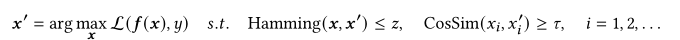

- 目标攻击 限制

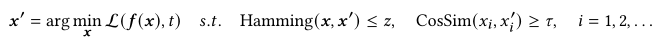

其中，目标项目t，对抗性实例x'。

### 3.2.3 对抗训练

可以通过最小化 扰动输入数据的**预期损失**来建立一个鲁棒推荐器。也就是在优化𝒇中的模型参数和基于𝒙更新敌对数据之间交替寻找均衡。

对抗性实例是在训练过程中动态生成的，并用于训练最小化损失函数L，使得模型𝒇被迫调整参数以抵抗对抗性的扰动。

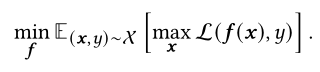

# 4 Methodology

## 4.1 配置文件污染攻击

本文提出的这个攻击算法既可以攻击历史项，也可以插入对抗性的项来“欺骗”推荐器。

非目标攻击：导致被污染的序列性能下降

目标攻击：导致目标项的暴露增加

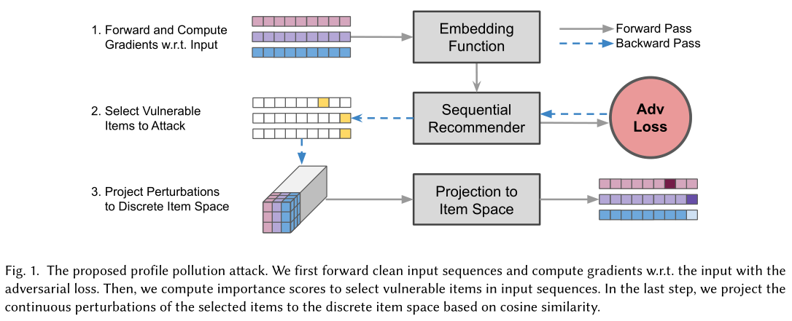

**Step1. 提出干净的输入序列+计算与对抗损失的梯度w.r.t.输入**

干净序列x，污染序列x'，使用嵌入函数fe计算出嵌入序列˜𝒙’，计算˜𝒙’的梯度，在嵌入空间中构造对抗性扰动。

其中，目标攻击和非目标攻击有细微差异。

目标攻击中有目标项目t，推荐函数fm输入˜𝒙’来计算交叉熵损失，然后进行反向传播，检索˜𝒙‘的梯度∇˜𝒙’。

非目标攻击就直接计算输出分布中预测项的交叉熵损失。

**Step2. 选择输入序列中要攻击的脆弱项目**

选择出脆弱项z并对这些项目进行替换，可以达到最佳的攻击性能。我们将∇˜𝒙‘中最后一个维度的$$l^2$$范数作为我们的重要性分数（即∥∇˜𝒙’∥），这样就可以通过梯度的陡度估计输入项的脆弱性。通过排名r选择脆弱项z。扰动嵌入˜𝒙‘可计算如下：

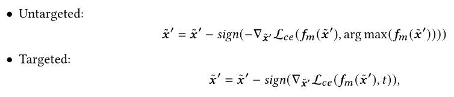

**Step3. 项目对项目空间的攻击（将所选项目的连续扰动投影到基于余弦相似度的离散项目空间）**

将扰动嵌入˜𝒙‘投影回项目空间。计算˜𝒙‘和候选项目的余弦相似度，相似度高被作为对抗性实例。

本文提出的配置文件污染攻击算法的伪代码如下：

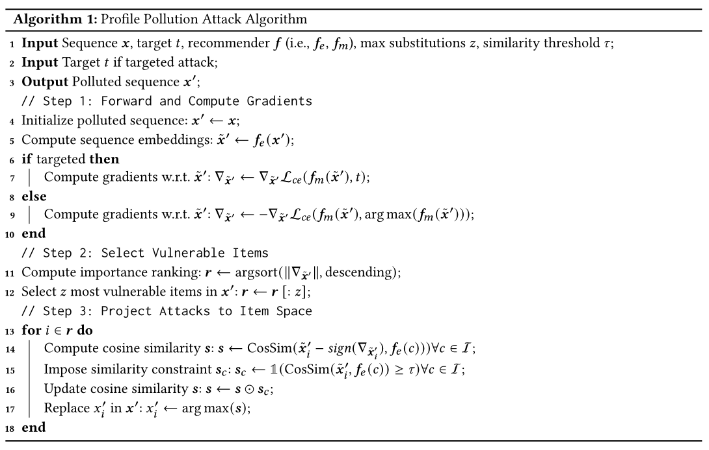

## 4.2 狄利克雷领域抽样

狄利克雷领域抽样：一种增强模型鲁棒性的随机训练方法。用于本文训练一个鲁棒序列推荐器。

推荐系统并不存在自然的邻居或同义词，针对这个问题，作者建议通过计算所有项目对之间的余弦相似度，为项目范围I中的每个项目构建一个领域。

*如果项目𝑖和项目𝑗的余弦相似度大于或等于𝜏(即CosSim（𝑖，𝑗）≥𝜏)，则将项目对（𝑖，𝑗）定义为邻居。在不存在邻居的情况下，使用相似度值最高的项目作为1跳邻居。

作者在 由项目的多跳邻居（顶点）所跨越的嵌入空间中 计算凸包。利用凸包作为增强项目嵌入的采样空间。从 由凸包中的顶点定义 的狄利克雷分布中进行抽样，以构造**随机嵌入**。通过在邻域内进行多次采样，推荐模型对局部扰动的敏感性较低，并学会了拒绝对抗性项目。

用从狄利克雷分布中采样的𝜼𝑖来表示增强项：

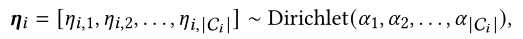

有了𝜼𝑖，可以计算增强项嵌入函数：

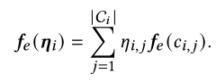

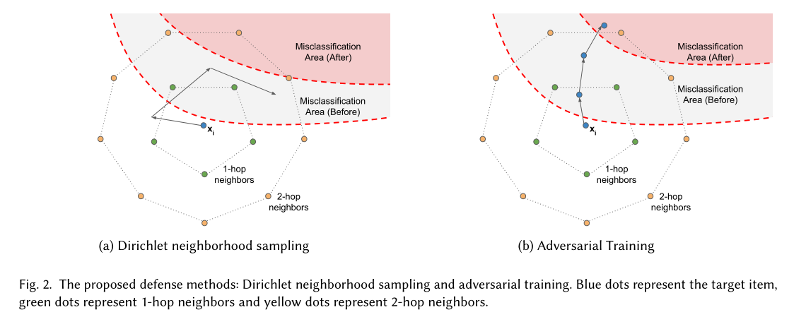

2b：蓝点的路径表示对抗性训练的更新迭代，其中对抗性的例子向错误分类区域移动，从而迫使推荐者抵抗最坏情况下的扰动。

## 4.3 混合表示的对抗性训练

狄利克雷领域抽样不利于计算最坏情况下增强的训练示例。对此，作者又提出了第二种防御方法：混合表示的对抗性训练。

本文提出的这个方法不是单独从局部领域进行抽样，而是在项目范围I中寻找项目𝜼在最坏情况下的线性组合——引入原始项目和潜在对抗性项目的混合表示，然后使用梯度上升更新𝜼来计算最坏情况下的线性组合，使原始项目嵌入和对抗性项目嵌入共同去优化鲁棒项目表示。

首先使用嵌入函数fe计算输入𝒙的嵌入序列˜𝒙，然后用序列模型fm转移˜𝒙，并基于优化损失函数计算梯度来更新𝜼𝑖：

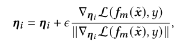

𝜼𝑖是I中所有项目的线性组合。在每次更新后剔除消极元素并重新调整𝜼𝑖：

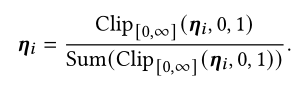

*狄利克雷领域抽样的增强方向是从局部凸包内的分布中抽样的，对抗性训练是使用项目的线性组合将梯度传播到项目表示中。这种最坏情况下的增强将模型的鲁棒性扩展到局部邻域之外的更大区域，从而有效地减少了错误分类的区域。

